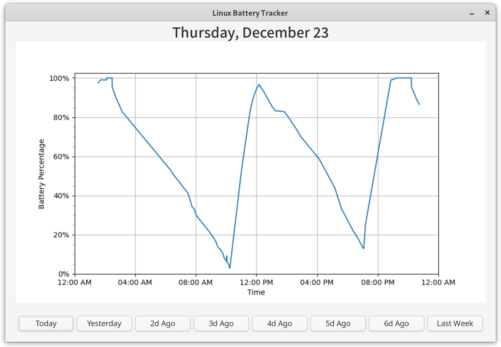

# Linux Battery Tracker
A Gtk app and Daemon that work together to track and display a unix laptop's battery life throughout the course of a week


## C Battery Daemon
In unix everything is a file, even the current battery voltage of you laptop! This program 
is a daemon process wriiten in c that reads the laptop current voltage, and calculates in current
percentage, and writes to a file the percentage and time it was calculated.

## Python Gtk
Displays the data written to the file with matplotlib

## Installation
The Battery Tracker stores the battery logs inside a directory it creates in /var/log/
Writting to this location requires admin premissions, this is given to the program by running it with the sudo command
To install this program run the following commands
```
git clone https://github.com/mkowusujr/Linux-Battery-Tracker.git
cd Linux-Battery-Tracker
sudo python installer.py
```
